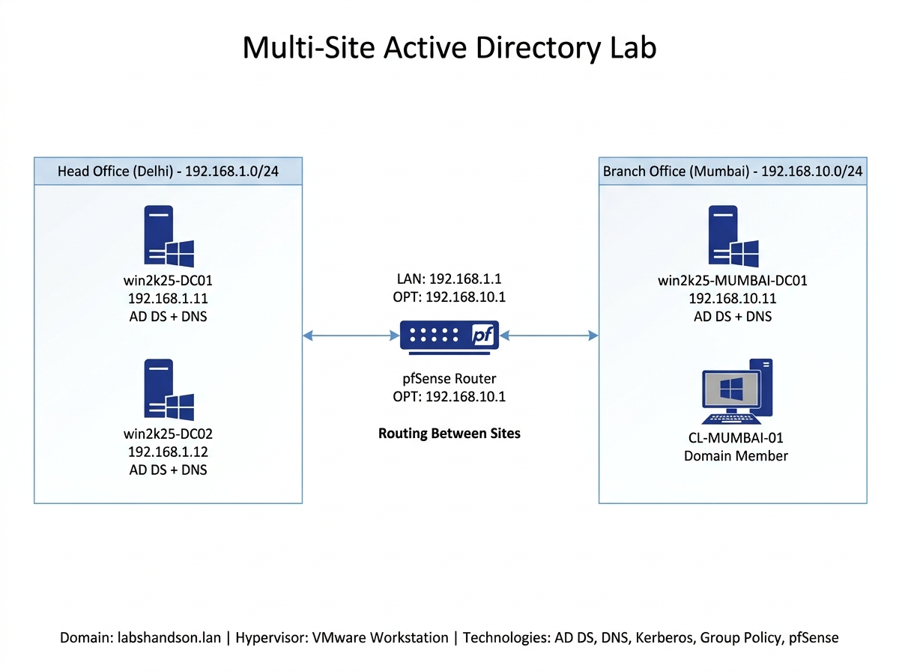

# Multi-Site Active Directory Lab with VMware & pfSense

A hands-on home lab simulating a real-world enterprise Active Directory environment with multiple sites connected through pfSense routing.

---

## Lab Overview

| Item | Details |
|------|---------|
| Domain | labshandson.lan |
| Head Office | LHO-HeadOffice-Delhi |
| Branch Office | LHO-BranchOffice-Mumbai |
| Head Office Network | 192.168.1.0/24 |
| Mumbai Network | 192.168.10.0/24 |
| Domain Controllers | win2k25-DC01 (192.168.1.11)<br>win2k25-DC02 (192.168.1.12)<br>win2k25-MUMBAI-DC01 (192.168.10.11) |
| Router | pfSense |
| Client | CL-MUMBAI-01 |
| Hypervisor | VMware Workstation |

---

# Technologies Used

- Windows Server 2025
- Active Directory Domain Services
- DNS
- Active Directory Sites and Services
- Group Policy
- Kerberos
- VMware Workstation
- pfSense
- Windows Client

---

# Network Topology

[](images/Topology.jpg)


# What I Built

- Configured two VMware Host-only networks.
- Installed and configured pfSense.
- Created a Multi-Site Active Directory environment.
- Promoted three Domain Controllers.
- Configured Active Directory Sites and Services.
- Joined a Windows client to the domain.
- Verified site association.
- Configured DNS.
- Tested Active Directory replication.
- Troubleshot Kerberos, replication, DNS and Secure Channel issues.

---

# Validation Tests

✔ Domain joined successfully

✔ DNS resolution working

✔ Active Directory replication verified

✔ SYSVOL replicated successfully

✔ Group Policy applied

✔ Client authenticated successfully

✔ Cross-site routing verified

✔ Sites and Subnets configured

---

# Useful Commands

```powershell
repadmin /replsummary

repadmin /showrepl

dcdiag /v

dcdiag /test:dns

nltest /sc_verify:labshandson.lan

nltest /dsgetdc:labshandson.lan

gpresult /r

ipconfig /all

nslookup

klist

w32tm /query /status
```

---

# Skills Demonstrated

- Active Directory Administration
- Multi-Site Active Directory
- DNS Administration
- Windows Server
- Kerberos Authentication
- Group Policy
- VMware Workstation
- pfSense Routing
- Network Troubleshooting
- Active Directory Replication

---

# Documentation

| File | Description |
|------|-------------|
| topology.md | Network architecture |
| installation-steps.md | Deployment steps |
| client-mumbai.md | Client configuration |
| troubleshooting.md | Issues and fixes |
| replication.md | Replication validation |
| dns.md | DNS configuration |
| kerberos.md | Kerberos troubleshooting |

---

# Screenshots

All related screenshots are available in the images/ folder.

## Lessons Learned
- DNS is the backbone of Active Directory
- Kerberos is extremely sensitive to time and SPNs
- Always clean stale computer accounts after forced demotion
- Proper Sites and Subnets configuration improves authentication and replication
- Lab environments require careful firewall and routing design

---

Built as a practical learning project to demonstrate Active Directory, Windows Server, Networking, DNS, and System Administration skills.

## Acknowledgments

This lab was inspired by and built while following educational content from the Labs Hands On YouTube channel. All configuration, testing, troubleshooting, and documentation in this repository were completed as part of my personal hands-on learning journey.
